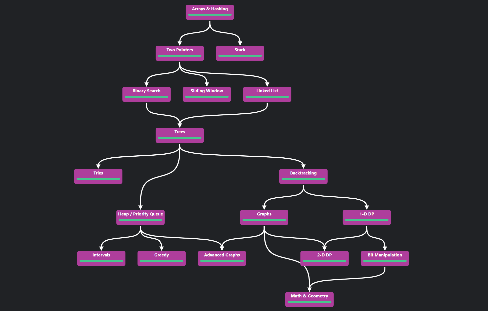

Based on https://neetcode.io/roadmap

## Directories Explanation

- check common problem patterns in `patterns`.
- check solutions to problem in `solutions`.
- run code (e.g. for the problem you're currently solving) in `src`.

## Setup

- For TypeScript: `npm install`

## Running Solution

- For Python3: `python .\src\index.py`
- For TypeScript: `npm run start`
- For Golang: `go run .\src\index.go`

